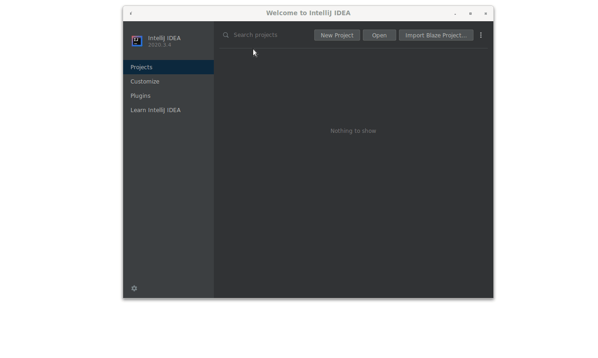

# Youtube Challenge - Java

Tasks implemented:
- [x] Task 1
- [x] Task 2
- [x] Task 3
- [ ] Task 4
- [ ] Extensions

The Java Youtube Challenge uses Java 11, Junit 5.4 and Maven.

NOTE: **Please do not edit videos.txt as it will cause tests to break. There is no need to modify this file to complete this challenge.**

## Installing Java and Maven

If you need to install Java, follow [these](https://java.tutorials24x7.com/blog/how-to-install-java-11-on-windows) 
instructions for Windows, and [these](https://docs.oracle.com/en/java/javase/11/install/installation-jdk-macos.html) instructions if you are on Mac.
The linux instructions are [here](https://docs.oracle.com/en/java/javase/11/install/installation-jdk-linux-platforms.html)

If you need to install Maven, follow the instructions in [this](https://www.baeldung.com/install-maven-on-windows-linux-mac) link.
> If you are on OSX Catalina, you might encounter issues while installing Maven, 
> such as "libjansi.jnilib” cannot be opened because the developer cannot be verified".
> In the Finder on your Mac, locate the problematic item (in this case jnilib) 
> and right-click -> Open With -> TextEdit. This will force your Mac to save
> whatever you opened as an exception. After performing this step, you can retry 
> the installation, and it should succeed.

> On Linux, if you are encountering some problems installing Maven, try the following:
> 1. Replace `export MAVEN_OPTS=-Xms256m -Xmx512m` with `export MAVEN_OPTS='-Xms256m -Xmx512m'`
> (added some single quotes around the value) in `.bashrc`.
> 2. Make sure that `/usr/local/apache-maven/apache-maven-3.8.1/bin` exists.
> Following the instructions you may happen to create `/usr/local/apache-maven/apache-maven-3.8.1/apache-maven-3.8.1/bin` instead. If that is the case, you can fix the issue by running:
> $ mv /usr/local/apache-maven/apache-maven-3.8.1/apache-maven-3.8.1/* /usr/local/apache-maven/apache-maven-3.8.1/
> $ rmdir /usr/local/apache-maven/apache-maven-3.8.1/apache-maven-3.8.1

## Setting up
You can write code in any editor you'd like. However, different editors have 
different ways of dealing with Java code, so in case of doubt we recommend 
you run the code and tests from the command line as shown below.

The below commands assume you are located in the java/ folder.

## Running and Testing from the Commandline
To build:
```shell script
mvn compile
```

To build & run:
```shell script
mvn exec:java
```
You can close the app by typing `EXIT` as a command.

#### Running all the tests
To run all the tests use the below code. You will have to compile your code before running 
the tests.
```shell script
mvn compile
```
```shell script
mvn test
```
If you haven't changed anything in the code, it's expected to see error messages like this:
```
[ERROR] Tests run: 67, Failures: 63, Errors: 0, Skipped: 0
```

To run tests for a single Part:
```shell script
mvn test -Dtest=Part1Test
mvn test -Dtest=Part2Test
mvn test -Dtest=Part3Test
mvn test -Dtest=Part4Test
```

## Running and Testing from IntelliJ
To import the project as a Maven project, follow [the official IntelliJ instructions](https://www.jetbrains.com/help/idea/maven-support.html#maven_import_project_start). Alternatively, you should be able to import the project at the java/ folder and IntelliJ will automatically recognize the project as a Maven project.
Make sure that the project SDK is set to Java 11, [the official IntelliJ instructions on how to set it or download it](https://www.jetbrains.com/help/idea/sdk.html#change-project-sdk). You can use any vendor for JDK 11 if you don't have it already downloaded.

To run the Application, click on the little green play symbol next to `Run`.
To run the tests, click on the little green double arrow next to the tests class.
To run all tests, right-click on the root `java` folder and select `Run 'All Tests'`.

Here is a screen capture showing all those initial steps:


